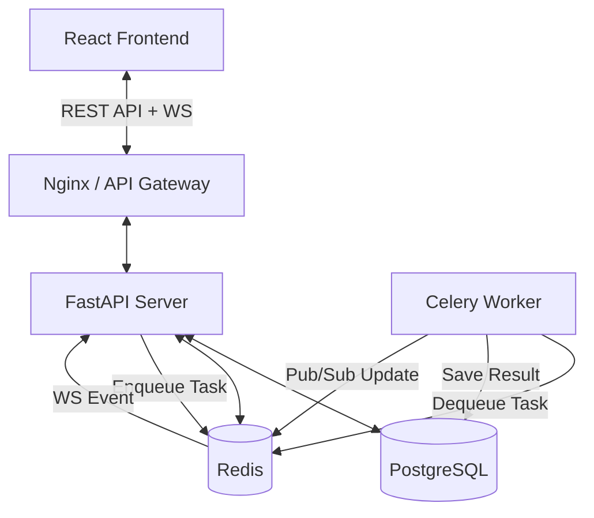

# OpenOCR Enterprise v3.0

### Intelligent Billing Document OCR & Data Extraction Platform

> **Version 3.0** · FastAPI + React + Celery + Postgres · Enterprise SaaS

OpenOCR Enterprise automates data extraction from billing documents — invoices, receipts, and purchase orders. It features a scalable async architecture, real-time updates, enterprise security (RBAC, Audit Logs), and a modern analytics dashboard.

---

## 🚀 Key Features v3.0

| Category | Feature | Details |
|----------|---------|---------|
| **Intelligence** | **Native PDF Extraction** | 100% accuracy for digital PDFs via PyMuPDF (no OCR noise) |
| | **Multi-Language OCR** | Support for English, Spanish, French, German, Chinese, and more |
| | **Hybrid Extraction** | Regex patterns + LLM fallback for high precision |
| **Real-time** | **Live Updates** | WebSocket-based progress bars for OCR jobs |
| | **Async Processing** | Celery + Redis for scalable background task management |
| **Enterprise** | **RBAC** | Role-Based Access Control (Admin vs User) |
| | **Audit Logs** | Comprehensive tracking of all system actions |
| | **API Keys** | Secure API access for third-party integrations |
| **Analytics** | **Dashboard** | Visual charts for document volume, processing time, and confidence |
| **UX** | **Dark/Light Mode** | Polished UI with theme toggle |

---

## 🏗️ Architecture



---

## 🛠️ Tech Stack

- **Backend:** FastAPI, Python 3.11, SQLAlchemy, Pydantic
- **Frontend:** React 19, Vite, Recharts, Tailwind-inspired CSS
- **Database:** PostgreSQL 15
- **Queue/Cache:** Redis 7
- **Worker:** Celery 5
- **OCR:** EasyOCR (GPU-ready), PyMuPDF (Fitz)
- **Deployment:** Docker Compose

---

## 🐳 Quick Start (Docker)

The recommended way to run OpenOCR Enterprise is via Docker Compose.

### Prerequisites
- Docker Desktop installed and running.

### 1. Clone & Start
```bash
git clone <repository-url>
cd "OCR Application"

# Start all services (detached)
docker compose up --build -d
```

### 2. Access the App
- **Frontend:** [http://localhost:5173](http://localhost:5173) (or 3000 depending on config)
- **API Docs:** [http://localhost:3001/docs](http://localhost:3001/docs)

### 3. Default Credentials
- **Sign Up** on the login page to create the first admin user (auto-promoted or configured in DB).
- Or use `admin@example.com` / `admin123` if seeded (check data seeding scripts).

---

## 🔒 Security

### Role-Based Access Control (RBAC)
- **Admin**: Can manage all jobs, view audit logs, manage users.
- **User**: Can only access their own jobs and documents.

### API Keys
Generate API keys in **Settings** to access endpoints programmatically.
Include the key in the header:
```http
X-API-Key: sk_...
```

### Audit Logs
Admins can view detailed logs of:
- Job creation/deletion
- Document exports
- API Key generation
- Login events

---

## 📚 API Documentation

Full interactive documentation is available at `/docs`.

### Key Endpoints
- `POST /api/upload`: Upload documents (PDF/Image)
- `GET /api/jobs/{id}`: Get job status and results
- `POST /api/jobs/{id}/extract`: Run field extraction
- `GET /api/analytics/stats`: Get dashboard metrics
- `POST /api/keys`: Generate API Key

---

## 💻 Local Development

If you want to run services individually without Docker (not recommended for full features due to Redis dependency):

1. **Start Services** (Postgres, Redis) manually or via `docker compose up db redis -d`.
2. **Backend**:
   ```bash
   cd server
   pip install -r requirements.txt
   export DATABASE_URL=postgresql://...
   python main.py
   ```
3. **Worker** (in separate terminal):
   ```bash
   cd server
   celery -A celery_worker.celery_app worker --loglevel=info
   ```
4. **Frontend**:
   ```bash
   cd client
   npm install
   npm run dev
   ```

---

## 📄 License

Proprietary / Enterprise License.
